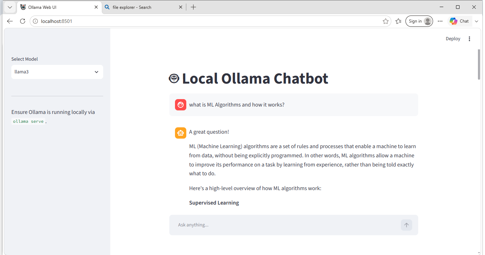

# 🤖 Local Ollama Chatbot

A simple, privacy-focused local chatbot interface powered by **Ollama** and built with **Streamlit**. It lets you chat with open-source Large Language Models (LLMs) locally on your hardware without sending data to external servers or incurring API costs.

---

## 📸 Preview



> **Note**: Place your actual screenshot image in the root repository folder as `screenshot.png` (or update the image path above to match your file name).

---

## ✨ Features

* **100% Private & Local**: All conversations and model inferences run directly on your local machine.
* **Multi-Model Selection**: Effortlessly switch between available Ollama models (e.g., `llama3`, `mistral`, `gemma`) via the sidebar menu.
* **Interactive UI**: Clean, responsive, and lightweight chat interface built using Streamlit.
* **Session Persistence**: Maintains active conversation state during your chat session.
* **Zero API Fees**: No subscription plans or cloud API key setup required.

---

## 💡 Uses & Application Cases

* **Privacy-Sensitive Tasks**: Summarize, write, or analyze confidential documents without cloud data exposure.
* **Offline AI Assistant**: Access an intelligent assistant even without an active internet connection.
* **Local Experimentation**: Ideal for testing open-source model responses, prompt engineering, and local LLM prototyping.
* **Development & Learning**: Lightweight sandbox to learn Streamlit GUI integrations with local AI engines.

---

## ⚙️ Installation

### 1. Prerequisites
Ensure you have Python 3.8+ installed, along with **Ollama**.

1. Download and install Ollama from [ollama.com](https://ollama.com).
2. Start the Ollama local engine:
   ```bash
   ollama serve
